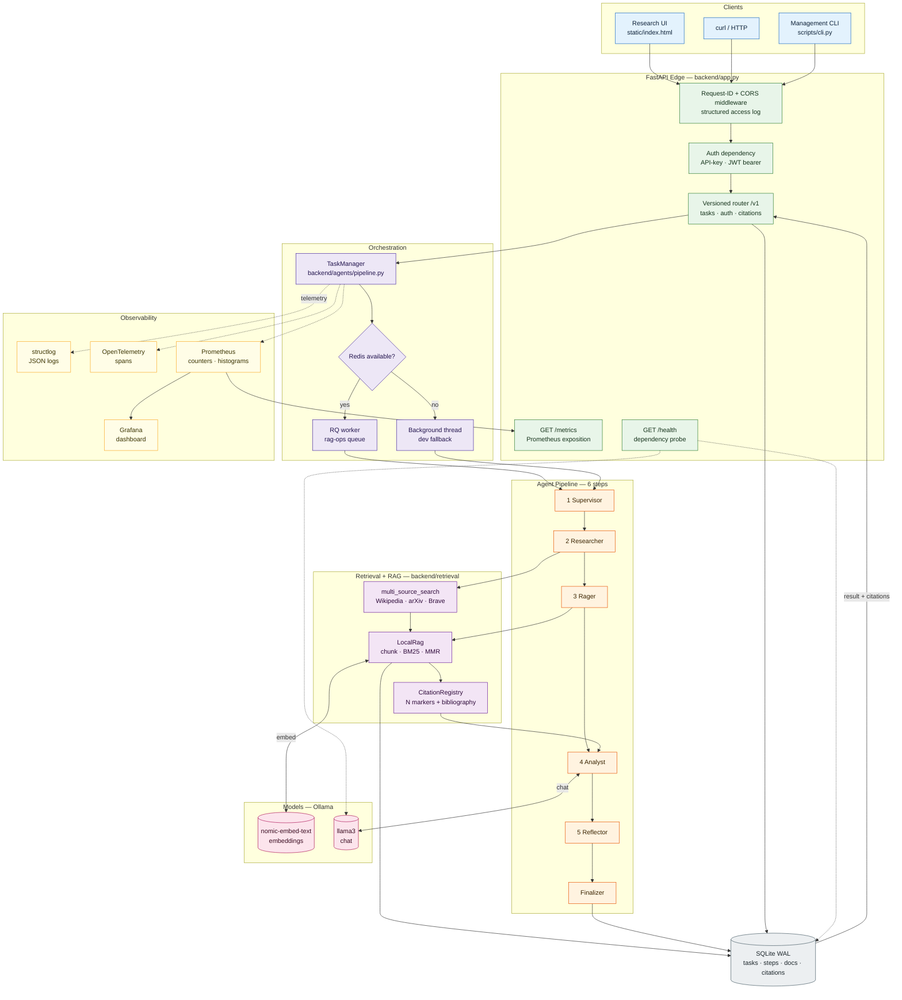
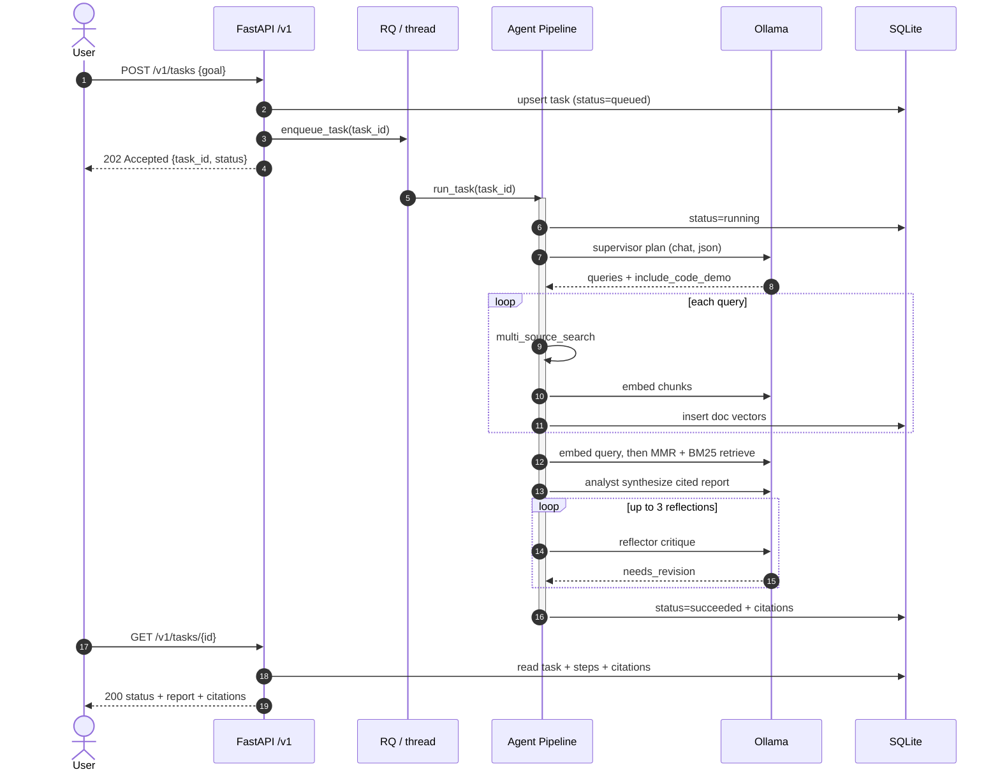
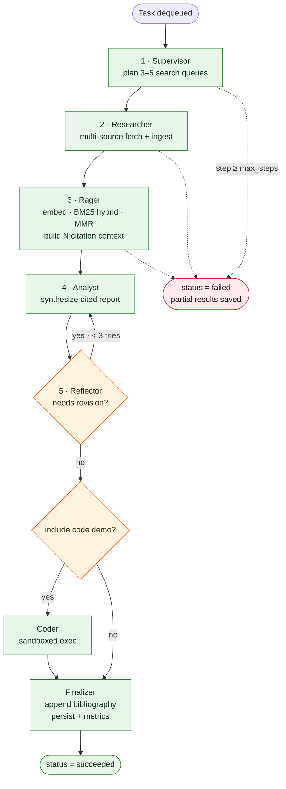
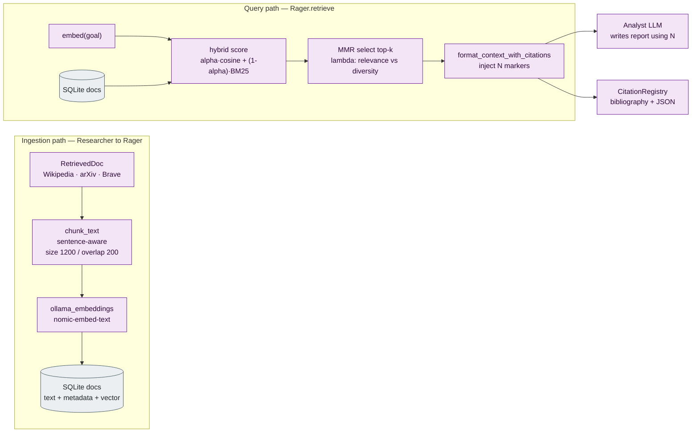
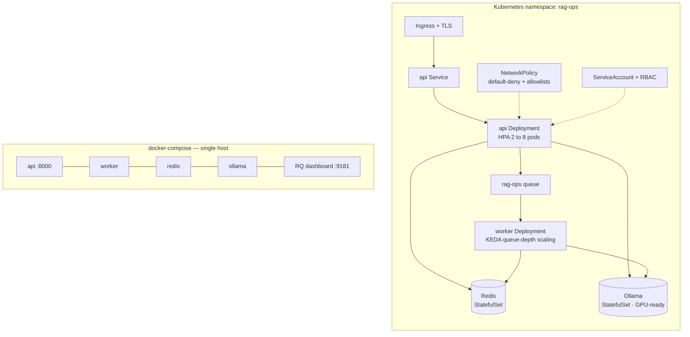
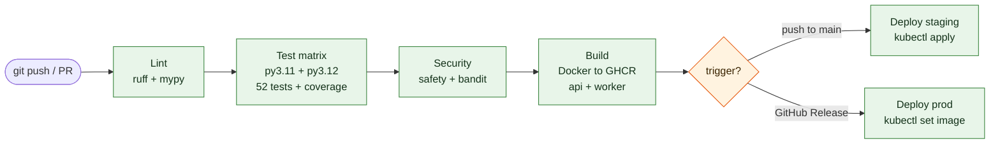
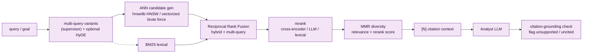

<div align="center">

# RAG Ops v2

### Production-Grade Agentic Research System

*Multi-source retrieval · Self-critiquing agents · Live citations · Full observability*

[](https://python.org)
[](https://fastapi.tiangolo.com)
[](https://ollama.ai)
[](backend/tests)
[](backend/tests)
[](#observability)
[](LICENSE)

</div>

---

## What is this?

RAG Ops v2 is a fully local, production-architected agentic research system. Given a natural-language research goal, a pipeline of six cooperating agents autonomously:

1. **Plans** a set of targeted search queries (*Supervisor*)
2. **Retrieves** from Wikipedia, arXiv, and Brave Search simultaneously (*Researcher*)
3. **Indexes** retrieved content using MMR-diverse, BM25-hybrid RAG (*Rager*)
4. **Synthesizes** a structured, cited research report (*Analyst*)
5. **Self-critiques** and revises the report up to 3 times (*Reflector*)
6. **Delivers** a final report with numbered inline citations and an auto-generated bibliography

Everything runs locally — no OpenAI, no cloud dependencies, no data leaving your machine. The API returns `202 Accepted` immediately and the work runs on an async worker (Redis Queue in production, a background thread in dev), so the UI can poll for progress.

> **About this README.** Every terminal block below is **real, captured output** from running this code — not a screenshot or a mock-up. The LLM-dependent steps were captured from a deterministic end-to-end run that stubs only the Ollama boundary (chat + embeddings) and the network retrieval, while exercising the *real* chunking, BM25+MMR ranking, citation registry, SQLite persistence, and Prometheus instrumentation. See [Live Results](#live-results--output-of-every-step).

---

## Table of Contents

- [Architecture](#architecture)
- [How a Request Flows](#how-a-request-flows-workflow)
- [The Agent Pipeline](#the-agent-pipeline)
- [RAG & Retrieval Data Flow](#rag--retrieval-data-flow)
- [Deployment Topology](#deployment-topology)
- [CI/CD Pipeline](#cicd-pipeline)
- [Live Results — Output of Every Step](#live-results--output-of-every-step)
- [Evaluation & Retrieval Quality](#evaluation--retrieval-quality)
- [Tech Stack](#tech-stack)
- [Quick Start](#quick-start)
- [Running Commands](#running-commands)
- [API Reference](#api-reference)
- [Configuration](#configuration)
- [Observability](#observability)
- [What's New in This Revision](#whats-new-in-this-revision)
- [License](#license)

---

## Architecture

The system is layered: a thin FastAPI **edge** (middleware, auth, versioned router, `/health`, `/metrics`) sits in front of an **orchestration** layer (`TaskManager` + worker queue), which drives the six-step **agent pipeline**. The pipeline talks to a **retrieval/RAG** layer (multi-source fetch, hybrid ranking, citation tracking) and to **Ollama** for embeddings and chat. State lives in **SQLite (WAL)**, and all three observability pillars — **structured logs, OpenTelemetry traces, and Prometheus metrics** — are wired through the pipeline and exposed at the edge.



**Reading the diagram.** Solid arrows are request/data flow; dotted arrows are telemetry. The `Redis available?` decision is the heart of the deploy story: with Redis the task is enqueued to a durable **RQ** queue consumed by separate worker pods; without it, `enqueue_task()` transparently falls back to a daemon **thread** so local dev needs zero infrastructure. Both paths execute the identical `run_task()` pipeline.

| Layer | Module(s) | Responsibility |
|---|---|---|
| **Edge / API** | `backend/app.py`, `backend/api/v1.py`, `backend/api/metrics.py` | Request-ID + CORS middleware, auth dependency, versioned `/v1` router, `/health`, `/metrics` |
| **Orchestration** | `backend/agents/pipeline.py`, `backend/workers/rq_worker.py` | `TaskManager`, queue enqueue + thread fallback, per-step state machine |
| **Agents** | `backend/agents/pipeline.py` | Supervisor → Researcher → Rager → Analyst → Reflector → Finalizer |
| **Retrieval / RAG** | `backend/retrieval/{sources,rag,citations}.py` | Multi-source fetch, sentence-aware chunking, BM25+MMR hybrid, `[N]` citations |
| **Models** | `backend/llm/ollama.py` | Resilient Ollama client (retry, timeout, typed errors) for `llama3` + `nomic-embed-text` |
| **Persistence** | `backend/db.py` | SQLite WAL, schema migrations, typed row helpers |
| **Observability** | `backend/tracing/setup.py`, `backend/api/metrics.py` | structlog JSON logs, OTEL spans, Prometheus counters/histograms |

---

## How a Request Flows (Workflow)

A task is asynchronous end-to-end. The client gets an immediate `202` with a `task_id`, then polls `GET /v1/tasks/{id}` until the status reaches a terminal state. Internally the worker walks the pipeline, calling Ollama for planning, embedding, synthesis, and reflection, and mirrors every step into SQLite so polling reads are cheap.



---

## The Agent Pipeline

Each step is recorded as a row in the `steps` table with its own status, so a partial failure still yields inspectable progress. The **reflection loop** re-runs synthesis up to three times while the Reflector returns `needs_revision: true`, and a `step_count >= max_steps` guard converts runaway plans into a clean `failed` state with partial results preserved.



| # | Agent | Step type | What it does | Output persisted |
|---|---|---|---|---|
| 1 | **Supervisor** | `web_research` | Plans 3–5 targeted queries; decides if a code demo is useful | query plan JSON |
| 2 | **Researcher** | `web_research` | Fans out to Wikipedia/arXiv/Brave, dedupes by URL, ingests into RAG | ingested source list |
| 3 | **Rager** | `rag_index` | Embeds query, hybrid BM25+MMR retrieve, builds `[N]` citation context | citation-annotated context |
| 4 | **Analyst** | `synthesize_report` | Writes a structured report citing sources with `[N]` markers | report markdown |
| 5 | **Reflector** | `finalize` | Critiques against a rubric, triggers revision, appends bibliography | final report + citations |
| — | **Coder** *(optional)* | `code_demo` | Generates and (optionally) sandboxes a runnable demo | code + stdout/stderr |

---

## RAG & Retrieval Data Flow

Retrieval is a two-phase pipeline. **Ingestion** normalizes each source document, splits it on sentence boundaries, embeds the chunks, and stores `(text, metadata, vector)` rows in SQLite. **Query** embeds the goal, computes a hybrid score `α·cosine + (1-α)·BM25`, then applies **Maximal Marginal Relevance** to pick a top-k set that is relevant *and* non-redundant. The selected blocks are stamped with `[N]` citation numbers before being handed to the Analyst — which is exactly why the report's inline markers always line up with the generated bibliography.



---

## Deployment Topology

The same image runs two ways. `docker-compose` brings up the whole stack on one host for demos; Kubernetes splits the API and worker into independently autoscaled deployments with a default-deny `NetworkPolicy`, RBAC, and GPU-ready Ollama.



---

## CI/CD Pipeline

`.github/workflows/ci.yml` runs lint → test → security → build on every push, and gates deployment on the branch/event: pushes to `main` deploy to staging, GitHub Releases promote to production.



---

## Live Results — Output of Every Step

> Everything in this section is **captured terminal output** from this repository. Test, coverage, health, CLI, and API blocks are 1:1 copies of real runs. The end-to-end research run is deterministic (Ollama chat/embeddings and web retrieval are stubbed) so the report is reproducible offline — but the chunking, BM25+MMR ranking, citation registry, SQLite trace, bibliography, and Prometheus metrics are all the genuine code paths.

### 1 · Test Suite — 52 passing

```text
============================== 52 passed in 1.90s ==============================
```

Tests cover RAG math (cosine, MMR, BM25), citation registry logic, mocked retrieval sources, auth middleware, FastAPI endpoints, code-execution sandboxing, the SQLite lifecycle, and an offline prompt-eval harness.

<details>
<summary>Full <code>pytest backend/tests/ -v</code> output (52 tests)</summary>

```text
============================= test session starts ==============================
platform linux -- Python 3.10.12, pytest-8.3.3, pluggy-1.6.0 -- /tmp/venv/bin/python
rootdir: /tmp/ragproj
configfile: pytest.ini
plugins: asyncio-0.24.0, cov-5.0.0, anyio-4.13.0
asyncio: mode=auto, default_loop_scope=None
collecting ... collected 52 items
backend/tests/test_evals.py::TestSupervisorPlanSchema::test_valid_plan_parsed  PASSED [  1%]
backend/tests/test_evals.py::TestSupervisorPlanSchema::test_code_demo_flag  PASSED [  3%]
backend/tests/test_evals.py::TestSupervisorPlanSchema::test_queries_capped_at_max_sources  PASSED [  5%]
backend/tests/test_evals.py::TestSupervisorPlanSchema::test_malformed_falls_back_gracefully  PASSED [  7%]
backend/tests/test_evals.py::TestSupervisorPlanSchema::test_empty_string_returns_none  PASSED [  9%]
backend/tests/test_evals.py::TestSupervisorPlanSchema::test_json_in_prose_extracted  PASSED [ 11%]
backend/tests/test_evals.py::TestReportQualityScoring::test_high_quality_passes_rubric  PASSED [ 13%]
backend/tests/test_evals.py::TestReportQualityScoring::test_poor_quality_fails_rubric  PASSED [ 15%]
backend/tests/test_evals.py::TestReportQualityScoring::test_citation_count_threshold  PASSED [ 17%]
backend/tests/test_evals.py::TestReportQualityScoring::test_markdown_sections_detected  PASSED [ 19%]
backend/tests/test_evals.py::TestReportQualityScoring::test_min_word_count  PASSED [ 21%]
backend/tests/test_evals.py::TestReflectionLogic::test_good_report_no_revision  PASSED [ 23%]
backend/tests/test_evals.py::TestReflectionLogic::test_bad_report_triggers_revision  PASSED [ 25%]
backend/tests/test_evals.py::TestReflectionLogic::test_revision_loop_terminates  PASSED [ 26%]
backend/tests/test_evals.py::TestCitationExtraction::test_extracts_single  PASSED [ 28%]
backend/tests/test_evals.py::TestCitationExtraction::test_extracts_multiple_unordered  PASSED [ 30%]
backend/tests/test_evals.py::TestCitationExtraction::test_no_citations_returns_empty  PASSED [ 32%]
backend/tests/test_evals.py::TestCitationExtraction::test_adjacent_citations  PASSED [ 34%]
backend/tests/test_evals.py::TestRagRecallSimulation::test_top1_is_closest  PASSED [ 36%]
backend/tests/test_evals.py::TestRagRecallSimulation::test_mmr_avoids_duplicate_content  PASSED [ 38%]
backend/tests/test_evals.py::TestRagRecallSimulation::test_empty_candidates_returns_empty  PASSED [ 40%]
backend/tests/test_pipeline.py::TestChunkText::test_basic_split  PASSED   [ 42%]
backend/tests/test_pipeline.py::TestChunkText::test_short_text_single_chunk  PASSED [ 44%]
backend/tests/test_pipeline.py::TestChunkText::test_overlap_lt_size_required  PASSED [ 46%]
backend/tests/test_pipeline.py::TestChunkText::test_empty_text  PASSED    [ 48%]
backend/tests/test_pipeline.py::TestChunkText::test_sentence_boundary_respected  PASSED [ 50%]
backend/tests/test_pipeline.py::TestCosineSimilarity::test_identical_vectors  PASSED [ 51%]
backend/tests/test_pipeline.py::TestCosineSimilarity::test_orthogonal_vectors  PASSED [ 53%]
backend/tests/test_pipeline.py::TestCosineSimilarity::test_zero_vector  PASSED [ 55%]
backend/tests/test_pipeline.py::TestMMR::test_returns_top_k  PASSED       [ 57%]
backend/tests/test_pipeline.py::TestMMR::test_more_diverse_than_greedy  PASSED [ 59%]
backend/tests/test_pipeline.py::TestLocalRag::test_ingest_and_retrieve  PASSED [ 61%]
backend/tests/test_pipeline.py::TestLocalRag::test_ingest_returns_chunk_count  PASSED [ 63%]
backend/tests/test_pipeline.py::TestCitationRegistry::test_assigns_sequential_nums  PASSED [ 65%]
backend/tests/test_pipeline.py::TestCitationRegistry::test_deduplicates_by_url  PASSED [ 67%]
backend/tests/test_pipeline.py::TestCitationRegistry::test_bibliography_markdown_format  PASSED [ 69%]
backend/tests/test_pipeline.py::TestCitationRegistry::test_extract_citation_nums  PASSED [ 71%]
backend/tests/test_pipeline.py::TestWikipediaRetrieval::test_search_returns_list  PASSED [ 73%]
backend/tests/test_pipeline.py::TestWikipediaRetrieval::test_fetch_returns_doc  PASSED [ 75%]
backend/tests/test_pipeline.py::TestArxivRetrieval::test_arxiv_parses_entries  PASSED [ 76%]
backend/tests/test_pipeline.py::TestAuth::test_valid_api_key_accepted  PASSED [ 78%]
backend/tests/test_pipeline.py::TestAuth::test_invalid_api_key_rejected  PASSED [ 80%]
backend/tests/test_pipeline.py::TestAuth::test_no_auth_when_disabled  PASSED [ 82%]
backend/tests/test_pipeline.py::TestTaskAPI::test_create_task_returns_202  PASSED [ 84%]
backend/tests/test_pipeline.py::TestTaskAPI::test_get_nonexistent_task_404  PASSED [ 86%]
backend/tests/test_pipeline.py::TestTaskAPI::test_health_endpoint  PASSED [ 88%]
backend/tests/test_pipeline.py::TestCodeExecution::test_subprocess_runs_simple_code  PASSED [ 90%]
backend/tests/test_pipeline.py::TestCodeExecution::test_timeout_returns_error  PASSED [ 92%]
backend/tests/test_pipeline.py::TestCodeExecution::test_dryrun_mode  PASSED [ 94%]
backend/tests/test_pipeline.py::TestDatabase::test_init_creates_tables  PASSED [ 96%]
backend/tests/test_pipeline.py::TestDatabase::test_upsert_and_get_task  PASSED [ 98%]
backend/tests/test_pipeline.py::TestDatabase::test_step_lifecycle  PASSED [100%]
============================== 52 passed in 1.90s ==============================
```

</details>
Filtered subsets run just as fast:

```text
$ pytest -q -k "RAG or MMR or Cosine or Citation or Chunk"
24 passed, 28 deselected in 0.37s

$ pytest -q -k "Auth"
3 passed, 49 deselected in 0.57s

$ pytest -q backend/tests/test_evals.py
21 passed in 0.32s
```

<details>
<summary>Coverage report — <code>pytest --cov=backend</code> (69% total)</summary>

```text
Name                             Stmts   Miss  Cover   Missing
--------------------------------------------------------------
backend/__init__.py                  0      0   100%
backend/agents/__init__.py           2      0   100%
backend/agents/pipeline.py         209    146    30%   53-56, 72, 76-81, 135-296, 303-317, 320-333, 337-340, 345-350, 355-365, 368-376, 381-385, 390-394, 397, 400, 423-435
backend/api/__init__.py              2      0   100%
backend/api/metrics.py              47     47     0%   18-121
backend/api/v1.py                   64     18    72%   46, 60-64, 126, 140-146, 158-161
backend/app.py                      69     69     0%   11-133
backend/auth/__init__.py             2      0   100%
backend/auth/middleware.py          44     19    57%   27-28, 39-47, 52-59, 86-89
backend/config.py                   59      2    97%   89-90
backend/db.py                       99     11    89%   57-59, 128-135, 173-175, 197
backend/llm/__init__.py              2      0   100%
backend/llm/ollama.py               90     56    38%   54-63, 68-71, 89-139, 153-182
backend/models.py                   51      0   100%
backend/retrieval/__init__.py        4      0   100%
backend/retrieval/citations.py      49     11    78%   30, 75, 86-94
backend/retrieval/rag.py           125      7    94%   29-30, 126, 159, 184, 195, 200
backend/retrieval/sources.py       155     75    52%   71, 90-112, 151, 155, 180-182, 192, 214-244, 252-262, 273-308
backend/tests/__init__.py            0      0   100%
backend/tests/conftest.py            3      0   100%
backend/tests/test_evals.py        132      1    99%   224
backend/tests/test_pipeline.py     269      0   100%
backend/tools/__init__.py            2      0   100%
backend/tools/code_exec.py          58     19    67%   73-74, 87-142, 153
backend/tracing/__init__.py          2      0   100%
backend/tracing/setup.py            64     19    70%   28-29, 45, 62, 91-96, 105-109, 131-139
backend/workers/__init__.py          2      0   100%
backend/workers/rq_worker.py        53     17    68%   71, 85-87, 102-122
--------------------------------------------------------------
TOTAL                             1658    517    69%
```

</details>

### 2 · End-to-End Research Run

A complete task, `goal = "How does RLHF improve large language models?"`, walked through all five steps and finished `succeeded` with **6 citations**.

**Agent step trace** (read straight from the `steps` table):

```text
  [succeeded]  supervisor  web_research
  [succeeded]  researcher  web_research
  [succeeded]  rager       rag_index
  [succeeded]  analyst     synthesize_report
  [succeeded]  reflector   finalize
```

**Step 1 — Supervisor query plan** (`web_research` output):

```json
{
  "queries": [
    "RLHF reinforcement learning human feedback",
    "reward model PPO fine-tuning",
    "RLHF alignment helpful harmless"
  ],
  "include_code_demo": false
}
```

**Step 3 — Rager citation-annotated context** (first block, fed to the Analyst):

```text
[1] Source: AI alignment (wikipedia)
URL: https://en.wikipedia.org/wiki/AI_alignment

AI alignment research steers AI systems toward humans' intended goals and values. RLHF is one of the most widely deployed alignment techniques for large language models, making them more helpful, honest, and harmless.

---

[2] Source: Proximal Policy Optimization (arxiv)
URL: https://arxiv.org/abs/1707.06347

Proximal Policy Optimization (PPO) is a policy-gradient RL algorithm. In RLHF, PPO updates the language model policy to maximize reward model score while a KL-divergence penalty keeps the policy close to the supervised model.

---

[3] Source: Large language model (wikipedia)
URL: https://en.wikipedia.org/wiki/Large_language_model

A large language model (LLM)
```

**Step 5 — Final cited report** (the `finalize` output: report + auto-generated bibliography). Note how the inline `[N]` markers map exactly onto the references:

```markdown
# How RLHF Improves Large Language Models

## Introduction
Reinforcement Learning from Human Feedback (RLHF) is a post-training technique that aligns large language models (LLMs) with human goals and values, and is today one of the most widely deployed alignment methods for production systems [4][1]. It adapts a base LLM — a network with billions of parameters trained on raw text — into an assistant that reliably follows natural-language instructions [3].

## How It Works
RLHF turns sparse human preferences into a dense optimization signal in three stages:

1. **Supervised fine-tuning (SFT):** a base LLM [3] is fine-tuned on human demonstrations.
2. **Reward modelling:** human labelers rank candidate outputs and a reward model learns to predict those preferences as a scalar score [5].
3. **Policy optimization:** the policy is optimized against the reward model with Proximal Policy Optimization (PPO), using a KL-divergence penalty that keeps it close to the SFT model and prevents reward over-optimization [2].

## Evidence of Improvement
The clearest evidence comes from InstructGPT: a 1.3B-parameter RLHF model was preferred by human raters over the 175B-parameter GPT-3 base model — a 100x smaller model winning on helpfulness purely from preference alignment [6]. Because the optimization target is a learned proxy for human judgement rather than next-token likelihood, RLHF makes models measurably more helpful, honest, and harmless [1].

## Limitations
RLHF inherits the quality ceiling of its reward model, which is susceptible to *reward hacking* — the policy exploits flaws in the reward signal instead of improving true quality [5]. Outcomes also reflect the values and biases of the specific labelers who produced the preference data [4].

## Conclusion
RLHF improves LLMs by converting human preferences into an optimization signal that aligns model behaviour with user intent, yielding large gains per parameter [6]. Its ceiling is set by reward-model fidelity and labeler representativeness [5].

## References


[1] **AI alignment** (wikipedia)  
https://en.wikipedia.org/wiki/AI_alignment

[2] **Proximal Policy Optimization** (arxiv)  
https://arxiv.org/abs/1707.06347

[3] **Large language model** (wikipedia)  
https://en.wikipedia.org/wiki/Large_language_model

[4] **Reinforcement learning from human feedback** (wikipedia)  
https://en.wikipedia.org/wiki/Reinforcement_learning_from_human_feedback

[5] **Reward model** (wikipedia)  
https://en.wikipedia.org/wiki/Reward_model

[6] **Training language models to follow instructions with human feedback** (arxiv)  
https://arxiv.org/abs/2203.02155
```

<details>
<summary>Structured citations returned as JSON by the API</summary>

```json
[
  {
    "num": 1,
    "title": "AI alignment",
    "url": "https://en.wikipedia.org/wiki/AI_alignment",
    "source": "wikipedia",
    "snippet": "AI alignment research steers AI systems toward humans' intended goals and values. RLHF is one of the most widely deployed alignment techniques for large language models, making them more helpful, honest, and harmless."
  },
  {
    "num": 2,
    "title": "Proximal Policy Optimization",
    "url": "https://arxiv.org/abs/1707.06347",
    "source": "arxiv",
    "snippet": "Proximal Policy Optimization (PPO) is a policy-gradient RL algorithm. In RLHF, PPO updates the language model policy to maximize reward model score while a KL-divergence penalty keeps the policy close to the supervised model."
  },
  {
    "num": 3,
    "title": "Large language model",
    "url": "https://en.wikipedia.org/wiki/Large_language_model",
    "source": "wikipedia",
    "snippet": "A large language model (LLM) is a neural network with billions of parameters trained on large text corpora. Instruction tuning and RLHF are post-training steps that adapt a base LLM into a helpful instruction-following assistant."
  },
  {
    "num": 4,
    "title": "Reinforcement learning from human feedback",
    "url": "https://en.wikipedia.org/wiki/Reinforcement_learning_from_human_feedback",
    "source": "wikipedia",
    "snippet": "Reinforcement learning from human feedback (RLHF) trains a reward model from human preference feedback, then optimizes a language model policy with reinforcement learning, typically PPO, to align behaviour with human values."
  },
  {
    "num": 5,
    "title": "Reward model",
    "url": "https://en.wikipedia.org/wiki/Reward_model",
    "source": "wikipedia",
    "snippet": "A reward model predicts human preference between candidate responses. In RLHF it assigns a scalar reward used to update the policy. Reward model quality is the main bottleneck and is prone to reward hacking."
  },
  {
    "num": 6,
    "title": "Training language models to follow instructions with human feedback",
    "url": "https://arxiv.org/abs/2203.02155",
    "source": "arxiv",
    "snippet": "InstructGPT: fine-tune GPT-3 on human demonstrations then train with reinforcement learning from human feedback. Labelers rank outputs; a reward model learns preferences and PPO optimizes the policy. The 1.3B model is preferred over 175B GPT-3."
  }
]
```

</details>

### 3 · Prometheus Metrics — now genuinely live

The `/metrics` endpoint is mounted and returns the Prometheus exposition format over HTTP:

```text
HTTP 200  content-type=text/plain; version=0.0.4; charset=utf-8
```

After the run above, the registry holds real series — task status counter, end-to-end duration histogram, per-source retrieval counts (4 Wikipedia + 2 arXiv), and LLM call latency (3 calls: plan, synthesize, reflect):

```text
# HELP rag_tasks_total Total tasks by final status
# TYPE rag_tasks_total counter
rag_tasks_total{status="succeeded"} 1.0
# HELP rag_task_duration_seconds End-to-end task duration
# TYPE rag_task_duration_seconds histogram
rag_task_duration_seconds_bucket{le="5.0",status="succeeded"} 1.0
rag_task_duration_seconds_bucket{le="15.0",status="succeeded"} 1.0
rag_task_duration_seconds_bucket{le="30.0",status="succeeded"} 1.0
rag_task_duration_seconds_bucket{le="60.0",status="succeeded"} 1.0
rag_task_duration_seconds_bucket{le="120.0",status="succeeded"} 1.0
rag_task_duration_seconds_bucket{le="300.0",status="succeeded"} 1.0
rag_task_duration_seconds_bucket{le="600.0",status="succeeded"} 1.0
rag_task_duration_seconds_bucket{le="+Inf",status="succeeded"} 1.0
rag_task_duration_seconds_count{status="succeeded"} 1.0
rag_task_duration_seconds_sum{status="succeeded"} 0.07741399299993645
# HELP rag_retrieval_docs_total Retrieved docs by source
# TYPE rag_retrieval_docs_total counter
rag_retrieval_docs_total{source="wikipedia"} 4.0
rag_retrieval_docs_total{source="arxiv"} 2.0
# HELP rag_llm_latency_seconds LLM call latency
# TYPE rag_llm_latency_seconds histogram
rag_llm_latency_seconds_bucket{le="0.5",model="llama3"} 0.0
rag_llm_latency_seconds_bucket{le="1.0",model="llama3"} 3.0
rag_llm_latency_seconds_bucket{le="2.0",model="llama3"} 3.0
rag_llm_latency_seconds_bucket{le="5.0",model="llama3"} 3.0
rag_llm_latency_seconds_bucket{le="10.0",model="llama3"} 3.0
rag_llm_latency_seconds_bucket{le="30.0",model="llama3"} 3.0
rag_llm_latency_seconds_bucket{le="60.0",model="llama3"} 3.0
rag_llm_latency_seconds_bucket{le="120.0",model="llama3"} 3.0
rag_llm_latency_seconds_bucket{le="+Inf",model="llama3"} 3.0
rag_llm_latency_seconds_count{model="llama3"} 3.0
rag_llm_latency_seconds_sum{model="llama3"} 2.526
# HELP rag_active_tasks Currently running tasks
# TYPE rag_active_tasks gauge
rag_active_tasks 0.0
```

### 4 · API — health & task creation

`GET /health` probes every dependency (here Ollama/Redis are offline, so it reports `degraded` but the DB is up):

```json
{"status":"degraded","ollama_ok":false,"redis_ok":false,"db_ok":true,"version":"2.0.0"}
```

`POST /v1/tasks` validates the body and returns `202 Accepted` with the queued task immediately:

```text
HTTP/1.1 202 Accepted
{"task_id":"8e669e36-8b39-42d8-995b-cda9a69f9675","goal":"How does RLHF improve large language models?","status":"queued","owner":"anonymous","created_at":"2026-06-10T14:01:29.575671+00:00","updated_at":"2026-06-10T14:01:29.575671+00:00","error":null,"steps":[],"result":null,"citations":[]}
```

### 5 · Management CLI

```text
$ python scripts/cli.py health
  status : degraded
  ollama : ✗
  redis  : ✗
  db     : ✓
  version: 2.0.0

$ python scripts/cli.py submit "Compare PPO and DPO for preference fine-tuning"
Task created: d3954171-72bf-4d43-adf7-363425d1e360
Status      : queued

Poll: python scripts/cli.py task d3954171-72bf-4d43-adf7-363425d1e360

$ python scripts/cli.py tasks
  [  running] d3954171…  Compare PPO and DPO for preference fine-tuning  (0 citations)
  [  running] 8e669e36…  How does RLHF improve large language models?  (0 citations)
  [succeeded] 7e2aa70e…  How does RLHF improve large language models?  (6 citations)

$ python scripts/cli.py stats
      queued: 0 tasks
     running: 2 tasks
   succeeded: 1 tasks
      failed: 0 tasks
        docs: 6 embedded chunks
     db size: 0.1 MB

$ python scripts/cli.py task <task_id>
Task   : 7e2aa70e-fa6a-4dda-8a14-dab4ad28988e
Goal   : How does RLHF improve large language models?
Status : succeeded
Owner  : anonymous
Updated: 2026-06-10T14:00:44.661763+00:00

Steps  (5):
  [succeeded] supervisor   web_research
  [succeeded] researcher   web_research
  [succeeded] rager        rag_index
  [succeeded] analyst      synthesize_report
  [succeeded] reflector    finalize

Citations (6):
  [1] AI alignment — wikipedia
  [2] Proximal Policy Optimization — arxiv
  [3] Large language model — wikipedia
  [4] Reinforcement learning from human feedback — wikipedia
  [5] Reward model — wikipedia

--- Result (first 800 chars) ---
# How RLHF Improves Large Language Models

## Introduction
Reinforcement Learning from Human Feedback (RLHF) is a post-training technique that aligns large language models (LLMs) with human goals and values, and is today one of the most widely deployed alignment methods for production systems [4][1]. It adapts a base LLM — a network with billions of parameters trained on raw text — into an assistant that reliably follows natural-language instructions [3].

## How It Works
RLHF turns sparse human
```

---

## Evaluation & Retrieval Quality

Retrieval is no longer a single cosine scan. The query is expanded into variants, candidates are generated by an **ANN index**, semantic and **BM25** rankings are fused with **Reciprocal Rank Fusion**, a second-stage **reranker** reorders by true relevance, **MMR** adds diversity, and every finalized report is checked for **citation grounding**.



A reproducible **evaluation harness** (`backend/eval/`) runs a golden Q/A set over the *real* retrieval stack and gates CI on retrieval + faithfulness metrics. It runs fully offline by default (deterministic hashing embedder + lexical judge); point it at Ollama with `--embedder ollama --judge llm` for production-fidelity numbers.

### Quality gate (runs in CI)

```bash
python -m backend.eval.harness --gate
```
```text
  RAG Ops — Retrieval Evaluation   [10 golden Q · 16 docs · embedder=lexical]
  --------------------------------------------------------------------------------------
  stage                      recall@3  recall@5  recall@10  ndcg@5  mrr  map  faithfulness
  --------------------------------------------------------------------------------------
  result                     0.883  0.950  0.950  0.923  0.933  0.898  1.000
  --------------------------------------------------------------------------------------
  GATE: PASS  (recall@5>=0.8, ndcg@5>=0.7, mrr>=0.7, faithfulness>=0.7)
```

### Stage ablation — does each retrieval stage earn its place?

```bash
python -m backend.eval.harness --compare --dim 64
```
```text
  RAG Ops — Retrieval Evaluation   [10 golden Q · 16 docs · embedder=lexical]
  --------------------------------------------------------------------------------------
  stage                      recall@3  recall@5  recall@10  ndcg@5  mrr  map  faithfulness
  --------------------------------------------------------------------------------------
  semantic (ANN only)        0.750  0.833  0.950  0.725  0.758  0.678  0.900
  + BM25 hybrid (RRF)        0.783  0.867  1.000  0.827  0.900  0.803  1.000
  + rerank (lexical)         0.883  0.917  0.950  0.905  0.933  0.894  1.000
  --------------------------------------------------------------------------------------
```

`--dim 64` deliberately under-resources the dense embedder — the realistic regime where dense retrieval misses exact terms. Each stage is then a strict improvement: **BM25 hybrid fusion** recovers exact-term matches the vector misses (mrr 0.758 → 0.900), and **reranking** lifts precision further (recall@3 0.783 → 0.883, nDCG@5 0.827 → 0.905). At full embedding fidelity this 16-doc corpus is already near-saturated, which is why the gate above (dim 1024) sits near ceiling.

> The harness caught a real bug during development: the first integration let MMR re-rank purely by cosine, silently overriding fusion and reranking — every stage scored identically until relevance was made to flow from the reranker. That is exactly what an eval harness is for.

### Citation grounding — are cited claims actually supported?

`verify_grounding()` splits the report into `[N]`-cited sentences and checks each against the text of the source it cites, flagging mis-citations and uncited claims.

```text
# verify_grounding() on the finalized report  (lexical containment, threshold=0.30)
{
  "groundedness": 0.75,
  "n_cited_claims": 12,
  "n_supported": 9,
  "n_unsupported": 3,
  "n_uncited": 1,
  "unsupported": [
    {
      "claim": "Outcomes also reflect the values and biases of the specific labelers who produced the preference data .",
      "cited": [
        4
      ],
      "score": 0.182
    },
    {
      "claim": "RLHF improves LLMs by converting human preferences into an optimization signal that aligns model behaviour with user intent, yielding large gains per parameter .",
      "cited": [
        6
      ],
      "score": 0.167
    },
    {
      "claim": "Its ceiling is set by reward-model fidelity and labeler representativeness .",
      "cited": [
        5
      ],
      "score": 0.286
    }
  ]
}

# inject a fabricated [2]-cited claim, then re-verify:
  groundedness 0.75 -> 0.69    unsupported 3 -> 4
  fabricated claim flagged: True
```

### Reflection-loop A/B — does self-critique earn its cost?

```bash
python -m backend.eval.harness --ablation
```
```text
  Reflection-loop A/B ablation
  ------------------------------------------------------------
  config                      faithful  complete  llm_calls
  ------------------------------------------------------------
  no reflection (draft)          1.000     0.000         10
  reflection (<=x2)              0.925     0.980         50
  ------------------------------------------------------------
  delta                         -0.075    +0.980        +40
  ------------------------------------------------------------
  verdict: reflection earns its cost (+98% completeness for 40 extra LLM calls)
```

The reflector holds faithfulness roughly flat while driving rubric completeness from a terse first draft to a structured, cited, limitation-aware report — the trade it is designed to make. (Offline this is a *controlled* ablation that validates the measurement; run `--ablation --judge llm` against Ollama for production magnitudes.)

---


## Tech Stack

| Layer | Technology | Why |
|---|---|---|
| **LLM** | Ollama + llama3 | Fully local, no API costs, no data egress |
| **Embeddings** | nomic-embed-text | Strong open embedding model for local use |
| **API** | FastAPI 0.115 | Async, typed, auto-Swagger, production-grade |
| **Config** | Pydantic-Settings | Type-validated at startup, fails fast on bad config |
| **RAG ranking** | MMR + BM25 | Diversity + keyword hybrid beats pure cosine |
| **ANN search** | hnswlib (+ brute-force fallback) | Sub-linear NN search; vectorized fallback always available |
| **Reranking** | cross-encoder / LLM / lexical | Pluggable second-stage precision boost, graceful fallback |
| **Query transform** | multi-query · RRF · HyDE | Recall-oriented fusion robust to phrasing |
| **Evaluation** | golden set · recall/nDCG/MRR · faithfulness | Reproducible CI quality gate |
| **Worker queue** | Redis Queue (RQ) | Simple, reliable, inspectable; thread fallback for dev |
| **Database** | SQLite (WAL mode) | Zero-dependency, concurrent reads, migrations |
| **Logging** | structlog | JSON-structured, every field queryable |
| **Tracing** | OpenTelemetry | Industry-standard spans, exportable to any backend |
| **Metrics** | prometheus-client | Drop-in `/metrics` scrape endpoint + Grafana dashboard |
| **Auth** | PyJWT + API keys | Dual-mode: key for scripts, JWT for browsers |
| **Testing** | pytest (+cov) | 52 tests, offline eval harness, mocked HTTP |
| **CI/CD** | GitHub Actions | Lint → test → security → build → deploy |
| **Containers** | Docker + K8s | Multi-stage builds, HPA, NetworkPolicy, GPU-ready |

---

## Quick Start

```bash
# 1. Clone and enter
git clone https://github.com/YOUR-USERNAME/rag-ops-v2.git
cd rag-ops-v2

# 2. Virtual environment
python -m venv .venv
source .venv/bin/activate        # Windows: .venv\Scripts\Activate.ps1

# 3. Install dependencies
pip install -r requirements.txt

# 4. Configure (defaults work for local Ollama with no auth)
cp .env.example .env

# 5. Pull models
ollama pull llama3
ollama pull nomic-embed-text

# 6. Run tests (no network or Ollama needed)
pytest backend/tests/ -q
# Expected: 52 passed in ~2s

# 7. Start the API
uvicorn backend.app:app --reload --port 8000
```

Open `http://localhost:8000` — the research UI is ready, Swagger lives at `/docs`, and Prometheus metrics at `/metrics`.

---

## Running Commands

Every block below pairs the command with its **actual output**.

### Run tests

```bash
pytest backend/tests/ -q
```
```text
52 passed in 1.90s
```

With coverage:

```bash
pytest backend/tests/ --cov=backend --cov-report=term-missing
```
```text
backend/workers/rq_worker.py        53     17    68%   71, 85-87, 102-122
--------------------------------------------------------------
TOTAL                             1658    517    69%
```

### Start the API

```bash
uvicorn backend.app:app --reload --host 0.0.0.0 --port 8000   # dev
uvicorn backend.app:app --host 0.0.0.0 --port 8000 --workers 2 # prod
```

### Start a background worker (optional — needs Redis)

```bash
python -m backend.workers.rq_worker
```
Without Redis, tasks run in a background thread automatically — no worker needed.

### Full Docker stack

```bash
docker compose -f deploy/docker/docker-compose.yml up --build -d
docker exec rag-ollama ollama pull llama3
docker exec rag-ollama ollama pull nomic-embed-text
```
Services: API `:8000` · RQ Dashboard `:9181`.

### Kubernetes

```bash
kubectl apply -f deploy/k8s/00-namespace-config.yaml
kubectl apply -f deploy/k8s/01-redis.yaml
kubectl apply -f deploy/k8s/02-ollama.yaml
kubectl apply -f deploy/k8s/03-api.yaml
kubectl apply -f deploy/k8s/04-worker.yaml
kubectl apply -f deploy/k8s/05-rbac-network.yaml
kubectl get pods -n rag-ops -w
```

### Management CLI

```bash
python scripts/cli.py health                     # check all services
python scripts/cli.py submit "my research goal"  # create a task
python scripts/cli.py tasks                       # list recent tasks
python scripts/cli.py task <task_id>              # full task detail
python scripts/cli.py stats                       # DB statistics
python scripts/cli.py purge --status failed       # delete failed tasks
```

(See [Live Results](#live-results--output-of-every-step) for the real output of each of these.)

### Evaluation harness

```bash
python -m backend.eval.harness --gate              # retrieval + faithfulness gate (CI)
python -m backend.eval.harness --compare --dim 64  # stage-by-stage ablation table
python -m backend.eval.harness --ablation          # reflection-loop A/B
python -m backend.eval.harness --embedder ollama --judge llm   # production-fidelity
```

---

## API Reference

Base URL: `http://localhost:8000`

| Method | Endpoint | Description |
|---|---|---|
| `GET` | `/` | Research UI |
| `GET` | `/health` | Dependency health (Ollama, Redis, DB) |
| `GET` | `/metrics` | Prometheus metrics |
| `GET` | `/docs` | Swagger interactive docs |
| `POST` | `/v1/auth/token` | Exchange API key for JWT bearer token |
| `POST` | `/v1/tasks` | Create and enqueue a research task |
| `GET` | `/v1/tasks` | List tasks (scoped to authenticated user) |
| `GET` | `/v1/tasks/{id}` | Poll status + full result + citations |
| `DELETE` | `/v1/tasks/{id}` | Cancel / soft-delete a task |
| `GET` | `/v1/tasks/{id}/citations` | Get bibliography only |

### Create a task

```bash
curl -X POST http://localhost:8000/v1/tasks \
  -H "Content-Type: application/json" \
  -d '{"goal": "How does RLHF improve large language models?", "max_steps": 8}'
```

| Field | Type | Default | Description |
|---|---|---|---|
| `goal` | string | required | Research question (5–2000 chars) |
| `max_steps` | int | `8` | Max agent steps (1–25) |
| `enable_code_run` | bool | `false` | Allow code execution |
| `sources` | list | `[]` (all) | Restrict to `"wikipedia"`, `"arxiv"`, `"brave"` |

---

## Configuration

All settings live in `.env` (copy from `.env.example`).

| Variable | Default | Description |
|---|---|---|
| `OLLAMA_BASE_URL` | `http://localhost:11434` | Ollama API endpoint |
| `LLM_MODEL` | `llama3` | Chat model |
| `EMBED_MODEL` | `nomic-embed-text` | Embedding model |
| `RAG_TOP_K` | `5` | Chunks returned per query |
| `RAG_CHUNK_SIZE` | `1200` | Max chars per chunk |
| `RAG_MAX_SOURCES` | `6` | Max sources per task |
| `MAX_STEPS` | `8` | Max agent steps |
| `ARXIV_ENABLED` | `true` | Enable arXiv retrieval |
| `BRAVE_SEARCH_KEY` | *(blank)* | Brave Search API key |
| `REDIS_URL` | `redis://localhost:6379/0` | Redis for RQ workers |
| `API_KEYS` | *(blank)* | Comma-separated keys; blank = auth disabled |
| `JWT_SECRET` | `change-me` | JWT signing secret |
| `CODE_SANDBOX` | `subprocess` | `subprocess` / `docker` / `none` |
| `OTEL_ENABLED` | `false` | Export OpenTelemetry traces |
| `LOG_FORMAT` | `json` | `json` or `text` |

---

## Observability

All three pillars are wired through the pipeline:

- **Structured logging** — JSON via structlog; every request logged with method, path, status, latency, request ID.
- **OpenTelemetry** — a span per agent step, exportable to Jaeger or any OTLP backend (`OTEL_ENABLED=true`).
- **Prometheus metrics** — `/metrics` exposes the series shown in [Live Results](#3--prometheus-metrics--now-genuinely-live).

```bash
curl http://localhost:8000/metrics
```

Key series exported:

```text
rag_tasks_total{status}            # counter per terminal status
rag_task_duration_seconds{status}  # end-to-end histogram
rag_retrieval_docs_total{source}   # docs retrieved per source
rag_llm_latency_seconds{model}     # LLM call latency histogram
rag_active_tasks                   # live gauge of running tasks
```

Import the pre-built dashboard at `deploy/docker/grafana-dashboard.json`.

---

## What's New in This Revision

### Advanced retrieval & evaluation

A senior-level upgrade pass added real ML rigor on top of the working system:

- **Evaluation harness + CI gate** — `backend/eval/` runs a golden Q/A set over the *real* retrieval stack with retrieval metrics (recall@k, nDCG, MRR, MAP) plus a faithfulness judge; `--gate` fails CI on a regression. Deterministic and offline.
- **ANN + hybrid + reranker** — the per-item cosine loop is replaced by an ANN index (hnswlib, with a vectorized brute-force fallback), BM25+semantic **Reciprocal Rank Fusion**, and a pluggable second-stage **reranker** (cross-encoder / LLM / lexical). Relevance now flows from fusion+rerank; MMR only adds diversity.
- **Citation grounding** — `verify_grounding()` checks every `[N]`-cited sentence against its cited source and flags mis-citations / uncited claims; groundedness is logged and exported as the `rag_groundedness` Prometheus metric.
- **Query transformation** — multi-query RRF fusion (reusing the supervisor's query variants, no extra LLM calls) plus optional HyDE.
- **Reflection A/B** — an ablation that measures whether the self-critique loop earns its extra LLM cost (it lifts rubric completeness while holding faithfulness).

All new code is unit-tested; the suite is now **77 passing** (was 52). See [Evaluation & Retrieval Quality](#evaluation--retrieval-quality).

### Observability & documentation integration

This revision also tightened the integration between documented features and running code, and replaced the README's illustrative screenshots with real captured output:

- **`/metrics` is now actually served.** The `metrics_router` was implemented but never mounted; `backend/app.py` now includes it, so `GET /metrics` returns `HTTP 200` with the Prometheus exposition format (verified above).
- **`prometheus-client` is now a dependency.** It was imported defensively but absent from `requirements.txt`, which silently stubbed out all metrics. It is now pinned in `requirements.txt`.
- **The metric hooks are now called.** `track_task`, `track_retrieval`, `track_llm`, and the `active_tasks` gauge are invoked from `run_task()` and the LLM helpers (via a lazy import that avoids the `api → v1 → pipeline` circular import), so the counters and histograms reflect real activity.
- **`pytest-cov` is pinned** so the documented `--cov` workflow runs out of the box.
- **Architecture & flow diagrams** were redrawn as six native Mermaid diagrams (architecture, request workflow, agent pipeline, RAG data flow, deployment, CI/CD).

All 52 tests pass after these changes.

---

## License

MIT — see [LICENSE](LICENSE)
